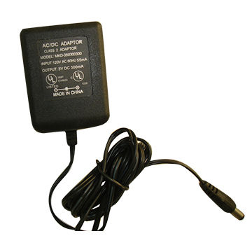
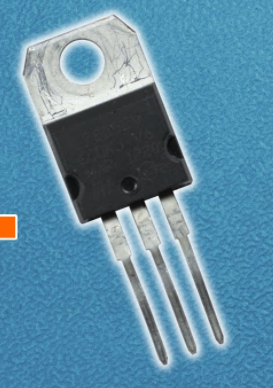

# Passive-Device
- 수동소자는 에너지를 소비만 한다.

## 용어
- 전압 : Electric Pressure(Voltage)
- 접지 : GND(Ground)
- 전류 : Current
  - 1A : 1C의 전하가 1초동안 이동하는 양
- 전력 : Electric Power
- 전원 : Electric Power Source
- AC
- DC
- 부하 : Load. 전원에 연결되어 에너지를 소비하는 모든 요소.
- SMD : Surface Mounting Device
- PCB : Printed Circuit Board
- Through-hole Type

## 식
- P = I * V
- I = V / R

## 단위

## 전원 변환 장치
  - AC -> DC
    - Linear Adaptor : Transformer를 사용.
      - 
    - SMPS Adaptor
      - SMPS(Switching Mode Power Supply) : 교류를 작은 시간 단위로 쪼갠 후 다시 조합해서 전압을 낮춤.
      노이즈가 발생하기 쉽다.

  - DC -> DC
    - 전압을 낮추는데 사용하는 부속품들
    - 반도체 소자에 의해서 전압을 원하는 레벨로 down시킨다.
    - LDO(Low Drop Out Regulator)
      
    - 방열판이 위에 길게 있어서 열을 발산시킨다.
    - DC -> DC 로 변환하는 것 또한 SMPS 방식이 있는데 노이즈가 많이 발생한다.
